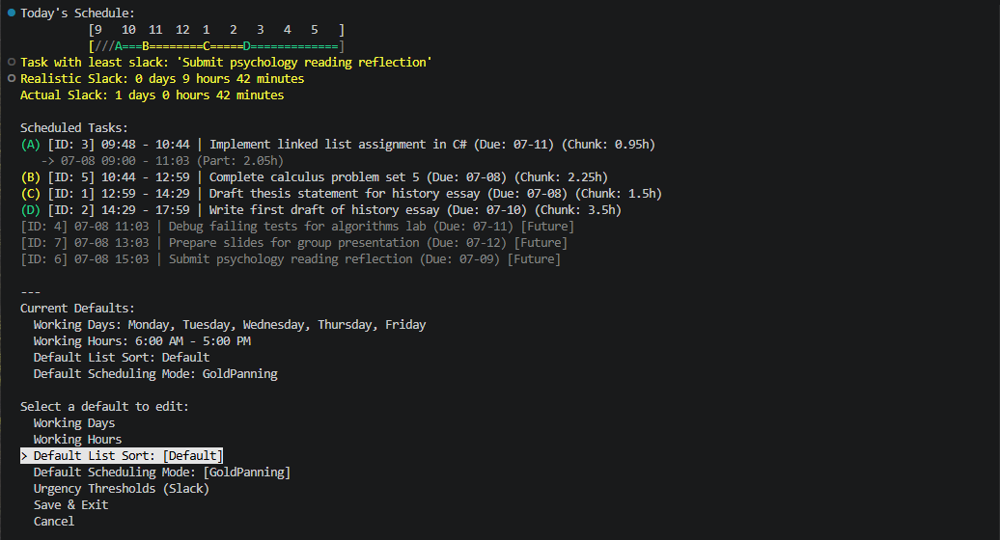
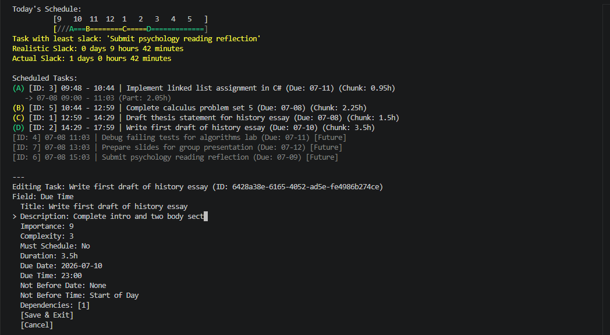

# Priority Task Manager

Priority Task Manager is a .NET console application that helps turn task lists into prioritized, schedule-aware work plans. It combines task management, list-scoped settings, JSON persistence, and a staged scheduling engine in a single local-first tool.

## Why This Exists

The project exists to reduce decision fatigue when planning work. Instead of forcing the user to manually sort every task, the application builds a schedule from task data, due dates, dependencies, and availability.

## Current Capabilities

- Task CRUD: add, edit, view, complete, uncomplete, and delete tasks.
- List management: create, switch, list, and delete task lists.
- List-scoped settings: work hours, work days, sort option, scheduling mode, and simulated time preference.
- Scheduling: Gold Panning is the active scheduling strategy.
- Events: add, list, edit, and delete calendar-style event blocks.
- Local persistence: data is stored in JSON files.





## Quick Start

Prerequisite:

- .NET SDK 8.0 or later

Build the solution:

```bash
dotnet build
```

Run the CLI:

```bash
cd PriorityTaskManager.CLI
dotnet run
```

### Flutter Client

Prerequisite:

- Flutter SDK matching the version pinned in `PriorityTaskManager.Flutter/pubspec.yaml` (`environment.sdk`). If `flutter pub get` fails with an SDK version solving error, run `flutter upgrade` (stable channel) and retry.

Fetch dependencies and run:

```bash
cd PriorityTaskManager.Flutter
flutter pub get
flutter run -d windows   # or -d chrome for web
```

The Flutter client calls a local `PriorityTaskManager.API` sidecar to compute schedules; see [docs/ARCHITECTURE_INTEGRATIONS.md](docs/ARCHITECTURE_INTEGRATIONS.md) for how that sidecar is launched.

## Repository Map

| Path | Purpose |
| --- | --- |
| `PriorityTaskManager/` | Core models, services, persistence, and scheduling logic |
| `PriorityTaskManager.CLI/` | Command-line entry point, handlers, and console rendering |
| `PriorityTaskManager.API/` | ASP.NET Core Web API surface sharing the core service composition (in progress) |
| `PriorityTaskManager.Flutter/` | Flutter web/desktop client (local-only for the MVP shell) |
| `pt_prototyping/` | Standalone Flutter sandbox for UI/UX prototyping, not part of the shipped product |
| `PriorityTaskManager.Tests/` | Unit test project |
| `docs/` | Architecture, status, workflow, testing, and roadmap docs |

## Documentation Map

Use these docs as the canonical references:

- [docs/VISION.md](docs/VISION.md): long-term desired outcome, target users, and core differentiator.
- [docs/STATUS.md](docs/STATUS.md): current capabilities, limitations, known issues, and command surface.
- [docs/ARCHITECTURE.md](docs/ARCHITECTURE.md): architecture map, shared boundaries, and links to focused architecture documents.
- [docs/ARCHITECTURE_INTEGRATIONS.md](docs/ARCHITECTURE_INTEGRATIONS.md): API surface, external integrations, and shared service composition.
- [docs/WORKFLOW.md](docs/WORKFLOW.md): contribution workflow and day-to-day development process.
- [docs/TESTING_STRATEGY.md](docs/TESTING_STRATEGY.md): test philosophy and quality approach.
- Repository GitHub Issues: backlog and planned work.

## For Contributors

Start with [docs/WORKFLOW.md](docs/WORKFLOW.md) if you are changing code. Use [docs/ARCHITECTURE.md](docs/ARCHITECTURE.md) to understand the system boundaries, and check [docs/STATUS.md](docs/STATUS.md) before assuming a feature is already implemented.

## License

This project is licensed under the MIT License.